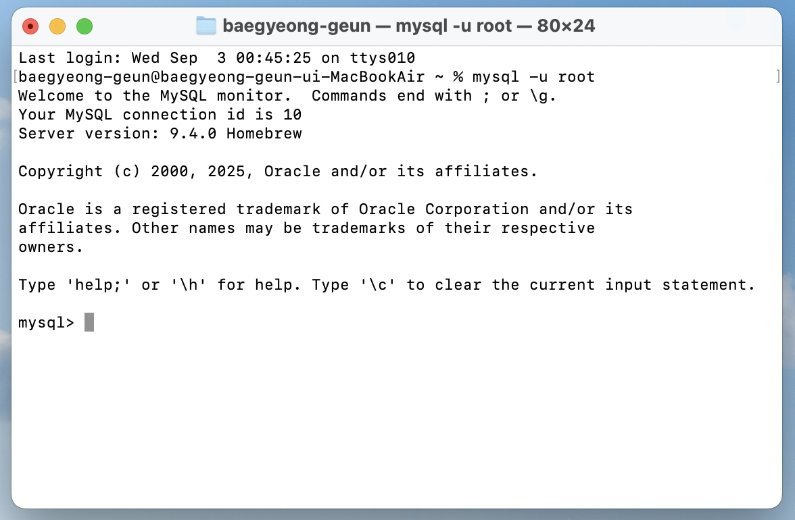
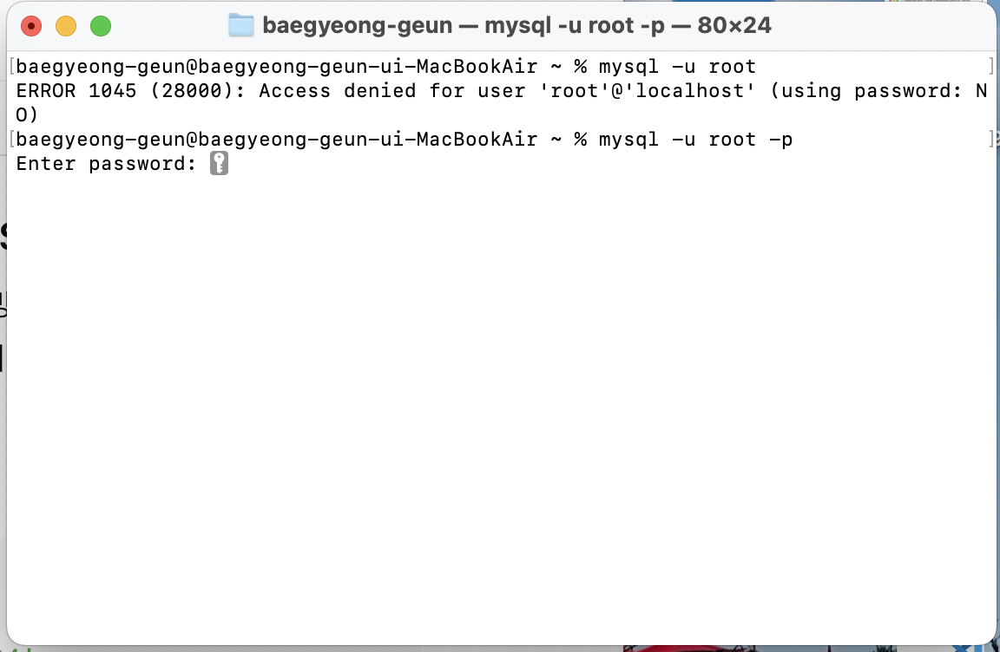
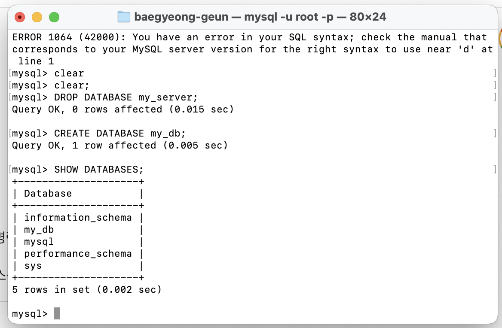
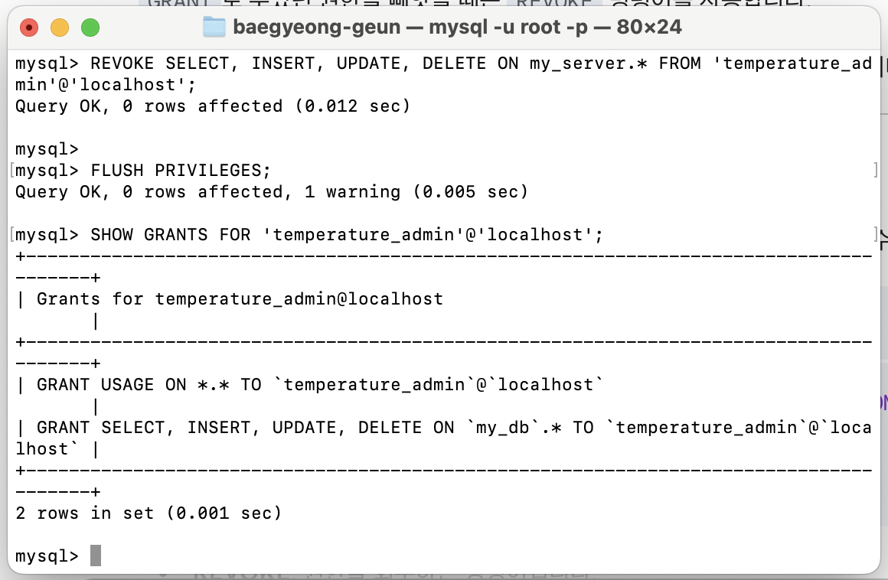
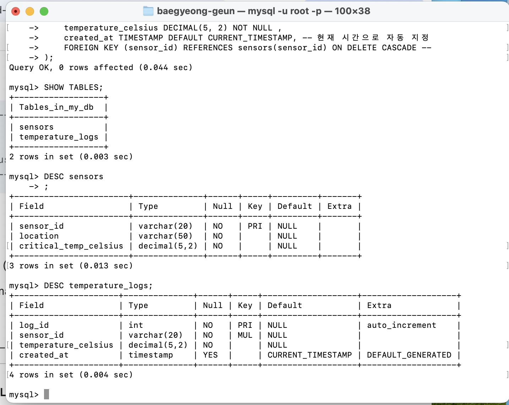
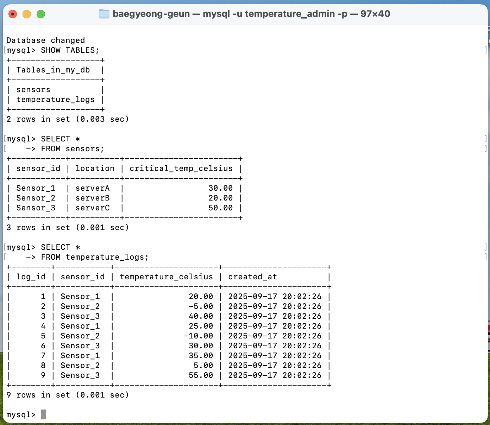
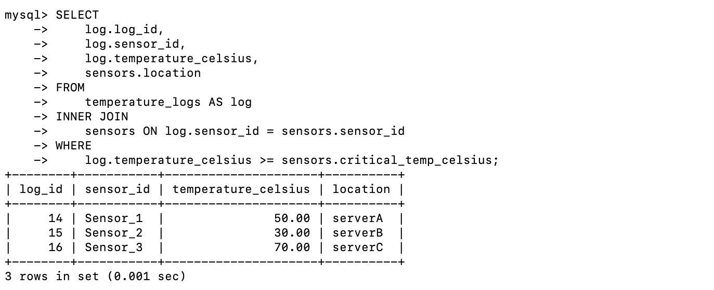
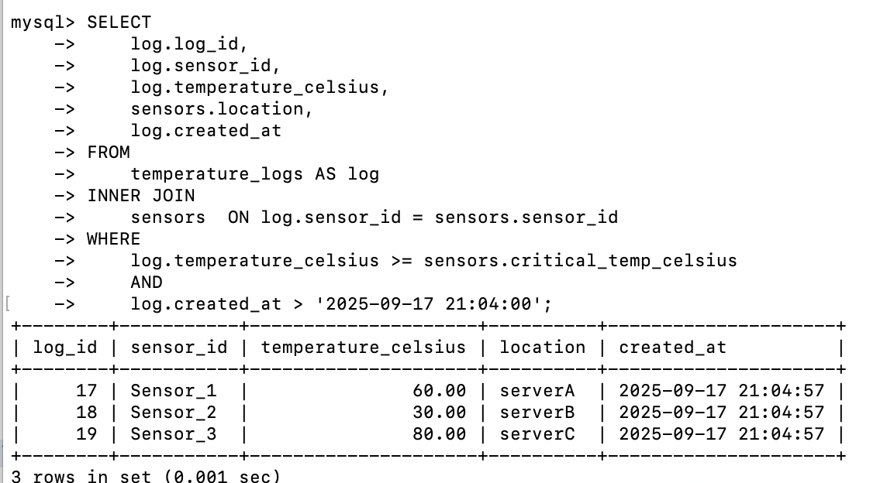
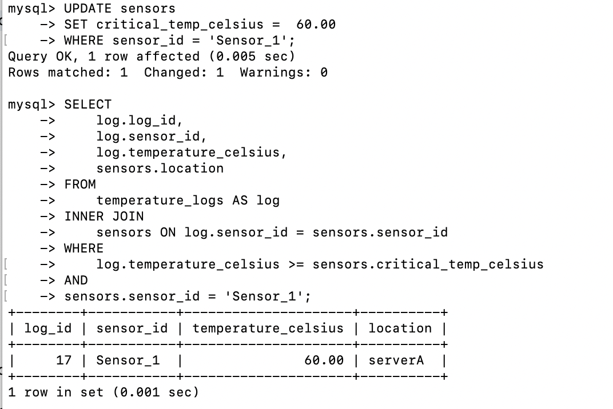
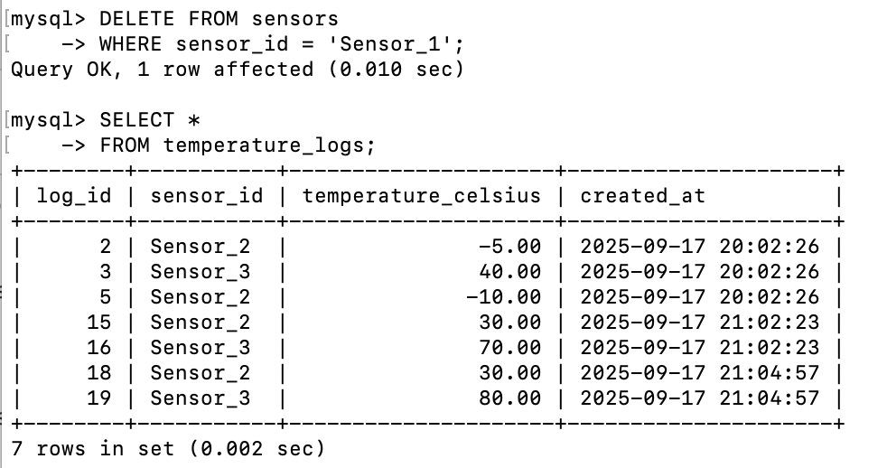

# 센서별 맞춤형 이상 온도 감지 및 로깅 시스템

>  각 센서별로 다른 온도 임계값(Threshold)을 설정하고, 이를 초과하는 이상 상황을 실시간으로 감지하여 기록하는 지능형 모니터링 시스템을 MySQL로 구현한 프로젝트입니다.

## 목차
1. 프로젝트 의미
    - 프로젝트 목적
    - 프로젝트 개요
    - 기술 스택 및 개발 환경
2. 구현 내용
    - 보안을 위한 전용 계정 설정
    - 스키마 설계
    - 데이터 시뮬레이션 및 이상 감지
3. 학습 내용
    - 데이터베이스 개요 
    - 데이터베이스 시스템
    - 스키마 생성(테이블 생성)
    - CRUD
    - 관계정의
    - JOIN
4. 과정
    - MySQL 설치
    - 사용자 & DB 생성
    - 테이블 생성 
    - 더미 데이터 추가
    - 데이터 검색
    - 데이터 변경


<br>

# 1. 프로젝트 의의


<br><details>
<summary>   프로젝트 목적  </summary>

* **관계형 데이터베이스 설계**: 목적에 따라 `sensors` (설정 정보) 테이블과 `temperature_logs` (시계열 데이터) 테이블을 분리하고, **PK와 FK**로 관계를 맺어 데이터의 정합성과 확장성을 확보했습니다.

* **JOIN을 활용한 데이터 통합**: 분리된 두 테이블을 `JOIN`하여, 각 센서의 **고유 임계값**을 기준으로 이상 온도를 판단하는 복합적인 데이터 조회 능력을 증명합니다.

* **실무 지향적인 쿼리 작성**: 단순 CRUD를 넘어, 실제 모니터링 시스템에서 요구되는 **위험 상황 감지**라는 구체적인 비즈니스 요구사항을 SQL로 해결하는 능력을 보여줍니다.


</details><br>
 
---
<br>
<details><summary> 프로젝트 개요  </summary>
<br>

> 단순히 온도를 기록하는 것을 넘어, **"A센서는 80도가 위험하지만, B센서는 50도만 넘어도 위험하다"** 와 같이 각기 다른 환경에 놓인 센서들을 지능적으로 관리할 필요가 있습니다.
이 프로젝트는 정적인 설정(하드코딩)이 아닌, 데이터베이스에 저장된 동적인 설정값을 기준으로 데이터를 분석하는, 한 단계 더 발전된 데이터 처리 능력을 갖추는 것을 목표로 합니다.


</details><br>

---

<br>
<details>
<summary>   기술 스택 및 개발 환경 </summary>

* **Database**: MySQL

* **Language**: SQL


</details><br>

<br>


# 2. 구현 내용


<br><details><summary> 보안을 위한 전용 계정 설정 </summary>

> root 계정 대신, 서버온도 관리용 사용자(temperature_admin)를 생성하고 my_db에 대한 CRUD 권한만 부여했습니다.

~~~bash
CREATE USER 'temperature_admin'@'localhost' IDENTIFIED BY '비밀번호';

# my_server 데이터베이스의 모든 테이블에 대한 CRUD 권한 부여
GRANT SELECT, INSERT, UPDATE, DELETE ON my_db.* 
TO 'temperature_admin'@'localhost';
FLUSH PRIVILEGES;
~~~

<br></details><br>

---

<br><details><summary> 스키마 설계 </summary>

> 센서의 '설정 정보'와 '측정된 데이터'를 명확히 분리하여 두 개의 테이블로 설계했습니다.

 
### 센서 설정 정보 테이블 (sensors)
각 센서의 고유 정보와 이상 온도를 판단할 임계값을 저장합니다.
```sql
CREATE TABLE sensors (
    sensor_id VARCHAR(20) PRIMARY KEY NOT NULL COMMENT '센서 고유 ID',
    location VARCHAR(50) NOT NULL COMMENT '설치 위치 (e.g., 서버랙, 냉각팬)',
    critical_temp_celsius DECIMAL(5, 2) NOT NULL COMMENT '위험 임계 온도(섭씨)'
);
```


### 온도 로그 테이블 (temperature_logs)
실제 측정된 온도 데이터를 시간 순서대로 기록합니다.
~~~sql
CREATE TABLE temperature_logs (
    log_id INT PRIMARY KEY NOT NULL AUTO_INCREMENT COMMENT '로그 고유 ID',
    sensor_id VARCHAR(20) NOT NULL COMMENT 'FK (sensors 테이블 참조)',
    temperature_celsius DECIMAL(5, 2) NOT NULL COMMENT '측정된 섭씨 온도',
    created_at TIMESTAMP DEFAULT CURRENT_TIMESTAMP COMMENT '기록 시각',
    FOREIGN KEY (sensor_id) REFERENCES sensors(sensor_id) ON DELETE CASCADE
);
~~~


<br></details><br>


---

<br><details><summary> 데이터 시뮬레이션 및 이상 감지 </summary>

1. 데이터 로깅 (INSERT)

~~~
-- 정상 온도 데이터 삽입
INSERT INTO temperature_logs (sensor_id, temperature_celsius) VALUES ('SENSOR-01', 25.5);
INSERT INTO temperature_logs (sensor_id, temperature_celsius) VALUES ('SENSOR-01', 26.1);

-- 이상 온도 데이터 삽입 (임계값 40도 가정)
INSERT INTO temperature_logs (sensor_id, temperature_celsius) VALUES ('SENSOR-01', 42.8); 
~~~


2. 이상 온도 감지 (SELECT)

~~~
-- 온도가 40도 이상인 모든 위험 로그 조회
SELECT *
FROM temperature_logs
WHERE temperature_celsius >= 40.0
ORDER BY created_at DESC;
~~~


3.오래된 로그 삭제 (DELETE)

~~~
-- 7일 이전의 모든 로그 데이터 삭제
DELETE FROM temperature_logs
WHERE created_at < NOW() - INTERVAL 7 DAY;

~~~


<br></details><br>


# 3. 학습 내용

<br><details><summary> 데이터베이스 개요 </summary>

### 데이터베이스 (DB, DataBase)
- **정의**: 여러 사용자가 공유하고 사용할 목적으로, 체계적으로 통합하여 관리하는 데이터의 집합입니다.
- **목적**: 단순히 데이터를 모아두는 것을 넘어, 필요할 때 원하는 정보를 효율적으로 검색, 추가, 수정, 삭제하기 위해 구조화된 형태로 데이터를 저장합니다.

<br>

### 데이터베이스 관리 시스템 (DBMS, DataBase Management System)
- **정의**: 사용자와 데이터베이스 사이에서, 데이터베이스를 생성하고 관리하며 효율적으로 사용할 수 있도록 돕는 소프트웨어입니다.
- **역할**: DBMS는 데이터베이스에 대한 모든 접근을 제어하며, 사용자가 직접 파일 시스템에 접근하지 않고도 데이터를 안전하고 편리하게 다룰 수 있도록 다양한 기능을 제공하는 인터페이스 역할을 수행합니다.
- **대표적인 DBMS**: Oracle, **MySQL**, MS SQL Server, PostgreSQL (이상 관계형), MongoDB, Redis (이상 비관계형) 등이 있습니다.

<br>

### DBMS의 장점
DBMS를 사용하면 다음과 같은 장점을 얻을 수 있습니다.

*   **데이터 독립성 확보**: 물리적/논리적 데이터 독립성을 통해, 데이터의 저장 구조가 변경되거나 논리적 구조가 변경되어도 관련 응용 프로그램을 수정할 필요가 없습니다.
*   **데이터 중복 최소화 및 일관성 유지**: 데이터를 통합 관리하여 불필요한 중복을 줄이고, 데이터가 여러 곳에서 다른 값을 갖는 비일관성 문제를 해결합니다.
*   **데이터 무결성 보장**: 제약조건(Constraints)을 통해 유효하고 정확한 데이터만 데이터베이스에 저장되도록 보장합니다.
*   **데이터 공유 및 동시 접근 제어**: 여러 사용자가 동시에 데이터에 접근하고 공유할 수 있으며, 동시성 제어(Concurrency Control)를 통해 데이터의 일관성을 해치지 않도록 관리합니다.
*   **데이터 보안 강화**: 사용자별로 접근 권한을 차등 부여하여 허가되지 않은 사용자의 데이터 접근을 막고 데이터를 안전하게 보호합니다.
*   **백업 및 복구**: 시스템에 장애가 발생했을 때, 데이터를 장애 발생 이전의 상태로 복구할 수 있는 안정적인 기능을 제공합니다.

<br>

### DBMS의 종류

> ### 관계형 DBMS (RDBMS)
> - **정의**: 모든 데이터를 2차원의 테이블(Table) 형태로 표현하고, 테이블 간의 관계를 이용해 데이터를 관리하는 시스템입니다.
> - **특징**: 정해진 스키마(Schema)에 따라 데이터를 저장해야 하므로 데이터의 구조가 명확하고, **ACID**(원자성, 일관성, 고립성, 지속성) 트랜잭션(Transaction)을 통해 데이터의 신뢰성을 보장합니다.
> - **대표 DBMS**: MySQL, Oracle, PostgreSQL 등

> ### 비관계형 DBMS (NoSQL)
> - **정의**: RDBMS의 테이블 구조보다 더 유연한 데이터 모델을 사용하는 DBMS를 총칭합니다.
> - **특징**: 스키마가 없거나(Schemaless) 동적으로 변경될 수 있어 자유로운 데이터 저장이 가능하며, 분산 환경에서의 뛰어난 확장성(Scalability)과 성능을 목표로 합니다. 데이터 모델에 따라 Document, Key-Value, Column-Family, Graph 등 다양한 유형이 있습니다.
> - **대표 DBMS**: MongoDB, Redis, Cassandra 등

<br></details><br>

<br><details><summary> 데이터베이스 시스템 </summary>

> **데이터베이스 시스템(DBS, DataBase System)** 이란, 일반적으로 데이터베이스(DB)와 이를 관리하는 DBMS, 그리고 관련된 응용 프로그램 및 사용자를 모두 포함하는 전체 시스템을 의미합니다.

이 프로젝트에서 사용하는 MySQL은 이러한 데이터베이스 시스템의 핵심인 DBMS에 해당하며, 그 내부 아키텍처는 크게 **MySQL 엔진**과 **스토리지 엔진** 두 개의 계층으로 나뉩니다.

### MySQL 서버 아키텍처

#### 1. MySQL 엔진 (MySQL Engine)
클라이언트의 요청을 받아 SQL을 분석하고 최적화하는, MySQL의 '두뇌' 역할을 담당합니다.

-   **커넥션 핸들러 (Connection Handler)**: 클라이언트의 접속, 인증, 그리고 각 클라이언트와 서버 간의 통신을 관리합니다.
-   **SQL 파서 (SQL Parser)**: SQL 문장의 문법을 검사하고, MySQL이 이해할 수 있는 단위(Parse Tree)로 분해합니다.
-   **옵티마이저 (Optimizer)**: 파싱된 쿼리를 어떻게 실행하는 것이 가장 효율적일지 실행 계획을 수립합니다. 이 과정에서 인덱스 사용 여부, 테이블 조인 순서 등을 결정하며, 쿼리 성능에 가장 큰 영향을 미칩니다.


#### 2. 스토리지 엔진 (Storage Engine)
MySQL 엔진이 수립한 실행 계획에 따라, 실제 데이터를 디스크에 저장하거나 읽어오는 물리적인 작업을 담당하는 부분입니다. MySQL은 '플러그인(Pluggable)' 방식을 지원하여, 테이블마다 다른 종류의 스토리지 엔진을 지정할 수 있습니다. 대부분 InnoDB를 사용합니다.

-   **InnoDB**: 현재 MySQL의 기본 스토리지 엔진입니다. **트랜잭션(Transaction)**과 **외래 키(Foreign Key)**를 지원하여 데이터의 일관성과 무결성을 강력하게 보장하며, 높은 동시성 처리 성능을 제공합니다. 이 프로젝트의 모든 테이블은 InnoDB 엔진을 사용합니다.


#### 3. 파일 시스템 (File System)
스토리지 엔진이 처리한 데이터를 실제 물리적인 파일(데이터 파일, 로그 파일 등)으로 디스크에 저장하는 운영체제(OS) 수준의 계층입니다.

<br></details><br>


<br><details><summary> 스키마 생성(테이블 생성) </summary>


> DB에는 데이터를 저장하는 포멧인 스키마를 설정하여
해당하는 스키마에 맞춰 데이터를 테이블에 저장합니다.

### 테이블 생성 자료형


| 분류 | 자료형  | 설명 | 예시 |
| :--- | :--- | :--- | :--- |
| **숫자형** | `INT` | 정수를 저장합니다. (e.g., -21억 ~ 21억) | `123`, `-456` |
| | `DECIMAL(p, s)` | **고정 소수점 숫자**를 정확하게 저장합니다. 금융 계산처럼 오차가 없어야 할 때 사용합니다. (p: 총 자릿수, s: 소수부 자릿수) | `DECIMAL(10, 2)` -> `12345678.99` |
| | `DOUBLE` / `FLOAT` | **부동 소수점 숫자**를 저장합니다. 매우 크거나 작은 과학적 숫자에 사용되나 미세한 오차가 발생할 수 있습니다. | `3.1415926535` |
| **문자열** | `VARCHAR(n)` | **가변 길이 문자열**을 저장합니다. `n`은 최대 길이를 의미하며, 실제 저장된 만큼만 공간을 차지합니다. (최대 65,535자) | `VARCHAR(50)` -> `'안녕하세요'` |
| | `TEXT` | 매우 긴 텍스트를 저장합니다. (최대 65,535자) 게시판 본문 등에 사용됩니다. | `'긴 텍스트...'` |
| | `CHAR(n)` | **고정 길이 문자열**을 저장합니다. `n`보다 짧은 데이터를 넣어도 항상 `n`만큼의 공간을 차지합니다. (최대 255자) | `CHAR(1)` -> `'Y'` 또는 `'N'` |
| **날짜/시간**| `TIMESTAMP` | 타임존 정보가 포함된 날짜와 시간을 저장합니다. (1970년~2038년) 시스템의 시간대에 따라 값이 변환될 수 있습니다. | `'2025-09-17 21:30:00'` |
| | `DATETIME` | 타임존 정보 없이 날짜와 시간을 저장합니다. (1000년~9999년) 입력된 값을 그대로 저장합니다. | `'2025-09-17 21:30:00'` |
| | `DATE` | 날짜(년, 월, 일)만 저장합니다. | `'2025-09-17'` |
| **기타** | `BOOLEAN` | `true` 또는 `false`를 저장합니다. | `true` / `false` |
| | `JSON` | JSON 형식의 데이터를 저장하고 효율적으로 조회할 수 있습니다. | `'{"name": "배경근", "age": 27}'` |


### 테이블 생성 옵션

| 옵션 (Option) | 설명 |
| :--- | :--- |
| `PRIMARY KEY` | 테이블의 각 행(row)을 고유하게 식별하는 **기본 키**입니다. `NOT NULL`과 `UNIQUE` 속성을 자동으로 포함합니다. |
| `FOREIGN KEY` | 다른 테이블의 `PRIMARY KEY`를 참조하는 **외래 키**입니다. 테이블 간의 관계를 정의합니다. |
| `NOT NULL` | 해당 열에 `NULL` 값이 들어올 수 없도록 강제합니다. 즉, 반드시 데이터가 입력되어야 합니다. |
| `UNIQUE` | 해당 열의 모든 값이 서로 달라야 함을 보장합니다. (단, `NULL`은 여러 개 허용될 수 있습니다.) |
| `AUTO_INCREMENT`| 새로운 행이 추가될 때마다 자동으로 1씩 증가하는 정수 값을 생성합니다. `PRIMARY KEY`에 주로 사용됩니다. |
| `DEFAULT` | 값을 명시적으로 입력하지 않았을 때 자동으로 들어갈 기본값을 설정합니다. |
| `COMMENT` | 해당 열에 대한 설명을 추가합니다. 스키마를 이해하는 데 도움을 줍니다. |


<br></details><br>


<br><details><summary> CRUD </summary>

> *CRUD*는 db뿐 아니라 소프트웨어가 갖춰야할 데이터처리 동작을 의미합니다.<br>
> - C : Create  = INSERT
> - R : Read    = SELECT
> - U : Update  = UPDATE
> - D : Delete  = DELETE

<br><br>
**INSERT**
~~~
INSERT INTO 테이블명 (컬럼1, 컬럼2, ...)
VALUES (값1, 값2, ...);

EX)
INSERT INTO temperature_logs (sensor_id, temperature_celsius, created_at)
VALUES ("1번센서",10); -- pk인 id와, created_at은 설정에 따라 자동 지정
~~~

<br>

**SELECT**
~~~
SELECT 속성1, 속성2
FROM 테이블명

EX)
SELECT *  -- 모든 속성을 의미
FROM temperature_logs;
~~~

<br>

**UPDATE**
~~~
UPDATE 테이블명
SET 컬럼1 = 새로운값1, 컬럼2 = 새로운값2, ...
WHERE 조건;

EX)
UPDATE temperature_logs
SET temperature_celsius = 20
WHERE  id = 1; ~~~
~~~

<br>

**DELETE**
~~~
DELETE FROM 테이블명
WHERE 조건;

EX)
DELETE FROM temperature_logs
WHERE sensor_id ="1번센서";
~~~


<br></details><br>


<br><details><summary> 관계정의 </summary>

> 데이터베이스에서의 '관계'는 테이블들을 서로 연결하여 데이터의 일관성과 무결성을 보장하는 핵심적인 개념입니다. 이 프로젝트에서는 sensors 테이블과 temperature_logs 테이블 간의 관계를 정의하여, 논리적으로 연결된 데이터를 효율적으로 관리합니다.

<br>

### 관계의 핵심: PK와 FK

*   **Primary Key (PK, 기본 키)**: 테이블의 각 행(row)을 고유하게 식별하는 값입니다. `sensors` 테이블의 `sensor_id`가 여기에 해당합니다.
*   **Foreign Key (FK, 외래 키)**: 한 테이블의 필드(column)가 다른 테이블의 PK를 참조하는 것을 의미합니다. `temperature_logs`의 `sensor_id`는 `sensors` 테이블의 `sensor_id`를 참조하는 FK입니다.

<br>

### 이 프로젝트의 관계: 1:N (일대다)

> `sensors`와 `temperature_logs`는 **1:N (일대다)** 관계를 가집니다.
> **"하나의 센서(`sensors`)는 여러 개의 온도 기록(`temperature_logs`)을 가질 수 있다."**

이 관계는 `temperature_logs` 테이블에 다음과 같이 `FOREIGN KEY` 제약조건을 설정함으로써 구현됩니다.

~~~sql
-- temperature_logs 테이블 생성 구문 중...
FOREIGN KEY (sensor_id) REFERENCES sensors(sensor_id) ON DELETE CASCADE
~~~

<br>

### `ON DELETE CASCADE`: 관계의 자동 관리

`ON DELETE CASCADE` 옵션은 관계의 무결성을 유지하기 위한 중요한 설정입니다.

*   **동작 방식**: 부모 테이블(`sensors`)에서 특정 센서의 데이터가 삭제될 경우, 해당 센서를 참조하고 있는 자식 테이블(`temperature_logs`)의 모든 관련 데이터(온도 로그)도 **자동으로 함께 삭제**됩니다.
*   **장점**: 더 이상 존재하지 않는 센서의 '고아 데이터(Orphan Data)'가 남는 것을 방지하여, 데이터의 정합성을 시스템이 자동으로 보장해줍니다. 예를 들어 `Sensor_1`이 철거되어 `sensors` 테이블에서 삭제되면, `Sensor_1`에 대한 모든 온도 로그 기록도 깔끔하게 사라집니다.

<br></details><br>


<br><details><summary> JOIN </summary>

> `JOIN`은 두 개 이상의 테이블에 나뉘어 저장된 데이터를, **공통된 컬럼(FK-PK 관계)을 기준으로 합쳐서** 하나의 결과 집합으로 조회하는 가장 중요한 SQL 기능 중 하나입니다.

<br>

이 프로젝트의 핵심 목표인 **"센서별 맞춤형 이상 온도 감지"** 를 구현하려면 `JOIN`이 필수적입니다.

-   측정된 온도 값은 `temperature_logs` 테이블에 있습니다.
-   하지만, 그 온도가 위험한지 판단하는 기준인 '임계 온도' 값은 `sensors` 테이블에 있습니다.

따라서, 두 테이블을 연결해야만 "측정된 온도가 해당 센서의 임계 온도를 넘었는지"를 비교할 수 있습니다.

<br>

### `INNER JOIN`을 활용한 이상 온도 감지

`INNER JOIN`은 두 테이블에 공통적으로 존재하는 데이터만을 결합합니다. `sensor_id`를 기준으로 두 테이블을 합친 뒤, `WHERE` 절을 사용해 이상 데이터를 선별하는 쿼리는 다음과 같습니다.

~~~sql
-- 각 센서의 '임계 온도'를 초과한 모든 로그를 조회
SELECT
    logs.log_id,
    logs.sensor_id,
    logs.temperature_celsius,
    sensors.critical_temp_celsius, -- 어떤 임계값을 넘었는지 확인하기 위해 SELECT에 추가
    logs.created_at,
    sensors .location
FROM
    temperature_logs AS logs -- 별칭(Alias)을 사용해 쿼리를 간결하게 만듦
INNER JOIN
    sensors ON logs.sensor_id = sensors .sensor_id
WHERE
    logs.temperature_celsius >= sensors .critical_temp_celsius -- 핵심: 자신의 임계값과 비교
ORDER BY
    logs.created_at DESC;
~~~

이 쿼리는 단순한 `SELECT`를 넘어, 관계형 데이터베이스의 장점을 극대화하여 "데이터에 기반한 지능형 분석"을 수행하는 실무적인 예시입니다.

<br></details><br>

<br><details><summary> 데이터 관리 </summary>

**Data Export**
~~~
mysqldump -u [사용자명] -p [데이터베이스명] > [저장할_파일명.sql]
~~~
백업,이전데이터 저장을 목적으로DB를 추출합니다.

<br>

**Data Import / Restore**
~~~
mysql -u [사용자명] -p [적용할_데이터베이스명] < [백업파일명.sql]
~~~
DB에 해당하는 파일 데이터를 적용합니다.


<br></details><br>

<br>

# 4. 과정


<br><details><summary> MySQL 설치 </summary>

## 설치 & 로그인

~~~bash
# mac
brew install mysql
brew services start mysql
~~~

~~~bash
# linux
sudo apt install mysql-server
sudo service mysql start
~~~

```sql
-- sql
mysql -u root
```




## root계정비밀번호설정

> 초기에 root계정에는 비밀번호가 설정되지 않습니다(auth_socket설정 = os와 같은 사용자가 접속하면 자동으로 접속허용). 모든권한을 가진 root의 비밀번호 설정은 매우 중요합니다.

```sql
ALTER USER 'root'@'localhost' IDENTIFIED BY '비밀번호';
```

비밀번호가 생긴후 `-p`옵션을 통해 접속이 가능해집니다.




<br></details><br>


<br><details><summary> DB & 사용자 생성 </summary>

## db생성

```sql
CREATE DATABASE my_db;
```

```sql
SHOW DATABASES;
```



## 사용자생성
```SQL

CREATE USER 'temperature_admin'@'localhost' IDENTIFIED BY '비밀번호'; 

```


```SQL
-- 해당 유저에게 my_db의 모든 테이블에 sql의 CRUD권한을 부여합니다. 
GRANT SELECT, INSERT, UPDATE, DELETE ON my_db.* TO 'temperature_admin'@'localhost';
```


```sql
-- 해당유저에게 부여된 권한을 보여줍니다.
SHOW GRANTS FOR 'temperature_admin'@'localhost';
```



<br></details><br>


<br><details><summary> 테이블 생성 </summary>

## 테이블생성

```sql
-- 데이터베이스 선택
use my_db
```

```sql
-- 센서 정보를 저장하는 테이블
CREATE TABLE sensors (
    sensor_id VARCHAR(20) PRIMARY KEY NOT NULL,
    location VARCHAR(50) NOT NULL,
    critical_temp_celsius DECIMAL(5, 2) NOT NULL
);
```

```sql
-- 센서로그를 저장하는 테이블
CREATE TABLE temperature_logs (
    log_id INT PRIMARY KEY NOT NULL AUTO_INCREMENT, -- AI옵션으로 자동으로 id지정
    sensor_id VARCHAR(20) NOT NULL, -- fk sensor 테이블의 pk
    temperature_celsius DECIMAL(5, 2) NOT NULL , 
    created_at TIMESTAMP DEFAULT CURRENT_TIMESTAMP, -- 현재 시간으로 자동 지정
    FOREIGN KEY (sensor_id) REFERENCES sensors(sensor_id) ON DELETE CASCADE -- 
);
```
>  시스템의 작동에서 더 이상 존재하지 않는 센서에 대한 로그는 불필요합니다. <br>
>  따라서 ON DELETE CASCADE 설정을 통해서  연속적으로 삭제되도록합니다.




<br></details><br>


<br><details><summary> 더미 데이터 추가 </summary>

```sql
-- 센서 데이터 추가
INSERT INTO sensors (sensor_id, location, critical_temp_celsius) VALUES
('Sensor_1', 'serverA', 30.00);

INSERT INTO sensors (sensor_id, location, critical_temp_celsius) VALUES
('Sensor_2', 'serverB', 0.00),
('Sensor_3', 'serverC', 50.00);
```

```sql
-- 각 센서의 로그데이터 추가
INSERT INTO temperature_logs (sensor_id, temperature_celsius) VALUES
('Sensor_1', 20.00),
('Sensor_2', -5.00),
('Sensor_3', 40.00),
('Sensor_1', 25.00),
('Sensor_2', -10.00),
('Sensor_3', 30.00),
('Sensor_1', 35.00),
('Sensor_2', 5.00),
('Sensor_3', 55.00);

```



<br></details><br>


<br><details><summary> 데이터 검색 </summary>

> 모든 로그에서 각 센서의 임계온도를 넘는 로그 조회
~~~sql
-- 각 센서의 '임계 온도'를 초과한 모든 로그를 조회
SELECT
    log.log_id,
    log.sensor_id,
    log.temperature_celsius,
    sensors.location
FROM
    temperature_logs AS log 
INNER JOIN
    sensors ON log.sensor_id = sensors.sensor_id
WHERE
    log.temperature_celsius >= sensors.critical_temp_celsius;

~~~



> 특정 시간이후 로깅된 데이터중 임계온도를 넘는 로그 조회
```sql
SELECT
    log.log_id,
    log.sensor_id,
    log.temperature_celsius,
    sensors.location,
    log.created_at
FROM
    temperature_logs AS log
INNER JOIN
    sensors  ON log.sensor_id = sensors.sensor_id
WHERE
    log.temperature_celsius >= sensors.critical_temp_celsius 
    AND
    log.created_at > '2025-09-17 20:10:00';
```



<br></details><br>

<br><details><summary> 데이터 변경 </summary>

> 임계값을 조절하면 추출되는 데이터 또한 변경된다.

```sql
UPDATE sensors
SET critical_temp_celsius =  60.00
WHERE sensor_id = 'Sensor_1';
```



>casecade 설정으로 센서가 제거되면 해당 센서의 로그또한 삭제됩니다.
```sql
DELETE FROM sensors
WHERE sensor_id = 'Sensor_1';
```



<br></details><br>

