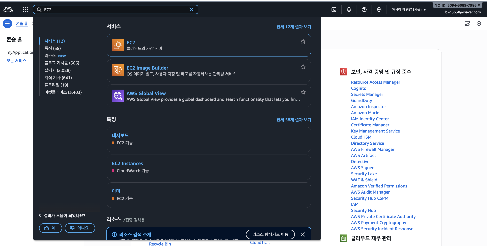

# SERVER-STUDY : 센서 데이터 기반 이상 감지 및 로깅 시스템 서버 구축

> 임베디드 시스템 개발자로서 하드웨어와 직접적으로 상호작용하는 경험을 바탕으로, 데이터가 최종적으로 어떻게 수집되고 관리되는지에 대한 이해를 넓히고자 백엔드 학습을 진행했습니다. 이 문서는 학습 과정과 '센서별 맞춤형 이상 온도 감지 및 로깅 시스템' 프로젝트의 서버를 구축하며 얻은 지식을 정리한 것입니다.

# 목차
1. [서버 기본 개념](#1-서버-기본-개념)
    -   클라이언트와 서버
    -   서버의 종류와 필요성
    -   네트워크 통신 기초
2.  [서버 구현 기술](#2-서버-구현-기술)
    -   JavaScript 런타임 및 프레임워크
    -   패키지 관리 (NPM)
    -   Express 핵심 기능
    -   데이터베이스 연동
3.  [API 설계 및 개발](#3-api-설계-및-개발)
    -   REST API의 이해
    -   RESTful API 설계
4.  [서버 배포 및 운영](#4-서버-배포-및-운영)
    -   클라우드 인프라 (AWS)
    -   서버 배포와 프로세스 관리
5.  [개발 보조 도구 및 기타 기술](#5-개발-보조-도구-및-기타-기술)
    -   버전 관리 및 협업
    -   개발 및 테스트 도구
6.  [실습: 이상 온도 감지 로깅 서버 구축](#6-실습-이상-온도-감지-로깅-서버-구축)      
    -   프로젝트 목표
    -   인스턴스 생성
    -   데이터베이스 스키마 설계
    -   API 명세서
    -   구현 과정 및 트러블슈팅

<br>

# 1. 서버 기본 개념

> 가장 먼저 '서버가 무엇이고 왜 필요한지'에 대한 큰 그림을 이해하는 단계입니다.

<details><summary>클라이언트와 서버</summary>

### 클라이언트 (Client) 

* 서비스를 요청하는 주체. (예: 웹 브라우저, 모바일 앱, **임베디드 기기**)

### 서버 (Server)
* 클라이언트의 요청을 받아 처리하고, 결과를 응답하는 주체.

</details><br>

<details><summary>서버의 종류와 필요성</summary>

> 기본적으로는 요청에 대한 응답을 할 수 있는 실행 환경이 갖추어진 모든 컴퓨터가 서버가 될 수 있지만, 일반적으로 24시간 365일 안정적으로 작동하며, 수많은 동시 요청을 고성능으로 처리하고, 필요에 따라 쉽게 확장할 수 있는 기능을 할 수 있는 컴퓨터가 서버 컴퓨터로 사용됩니다.

### 서버 요구 기능

-   **중앙 집중 관리:** 데이터의 일관성과 무결성 유지.
-   **고성능 처리:** 24/7 안정적인 서비스 제공을 위한 고사양 하드웨어 및 네트워크.
-   **보안:** 방화벽, 접근 제어 등을 통한 데이터 보호.

### 서버의 종류
                                
-   **웹 서버 (Web Server):** HTTP 요청을 받아 HTML, CSS 등 정적 콘텐츠를 제공. (예: Nginx, Apache)

-   **웹 애플리케이션 서버 (WAS, API Server):** 동적인 비즈니스 로직을 처리하고 데이터베이스와 상호작용. (예: Node.js/Express, Spring)

-   **데이터베이스 서버 (DB Server):** 데이터의 저장, 조회, 수정을 관리. (예: MySQL, PostgreSQL, MongoDB)


</details><br>

<details><summary>네트워크 통신 기초</summary>

### IP 주소
-    네트워크 상에서 기기를 식별하기 위한 고유 주소.
-   개인이 사용하는 IP는 해당 기기에 연결된 공유기의 서비스업체가 임대해준 IP를 사용하지만
    기업의 경우는 IP관리 기관에서 IP블록을 할당받아 사용하거나, 클라우드 서비스를 이용한다. 

-   `Pbulic IP` : 인터넷상에서 내컴퓨터(공유기)를 인식하기 위한 고유한 주소
-   `Private IP` : 내부 네트워크(공유기)에 연결된 기기

### PORT
-   하나의 IP 주소 내에서 특정 프로세스(애플리케이션)를 식별하기 위한 번호.
-   OS는 IP+PORT번호의 조합으로 소켓을 만들어 네트워크 통신을 허가한다.

### 프로토콜
- 각 기기간 통신의 규약을 의미한다.
- 각 계층의 프로토콜이 모두 준수되어야 유의미한 통신이 가능해진다.
- 이번 프로젝트는 웹 프로젝트인 만큼 HTTP(웹 통신 프로토콜)을 위해 라우팅/프록시 설정 및 API설계를 다룬다.

</details><br>

---

# 2. 서버 구현 기술
> 기본 개념을 바탕으로 실제 서버 프로그램을 만드는데 필요한 기술을 학습합니다.

<details><summary>Node.js</summary>

### 개념

- 브라우저 밖에서 JavaScript를 실행할 수 있게 해주는 런타임 환경
  Node.js를 통해 js로 작성된 다양한 App을 사용가능.

- 서버가 사용자에 요청에 따라 동적컨테츠를 제공해야 하는 복잡한 연사을 하는 `WAS(Web Application Server)`의 역할을 담당

- 이벤트기반, 논블로킹I/O

### 설치 및 사용

> node.js는 apt(패키지매니저)로 다운로드가 가능하긴 하지만 다운로드가 가능한 버전이 낮을 가능성이 높습니다.
> NVM(node version manger)를 이용해 원하는 버전(안정적인 lts버전)을 다운 할 수 있습니다.

1. NVM설치
   - `curl -o- https://raw.githubusercontent.com/nvm-sh/nvm/v0.40.1/install.sh | bash`
   - 터미널에 위 명령어를 입력하여 nvm설치 스크립트를  다운로드합니다.

2. NVM으로 Node.js설치
   -    `nvm install --lts`를 통해서 lts(long term surpport)와 같은 안정적인,최신버전을 다운로드 가능합니다.

3. 버전확인
    `node -v`를 통해 현재 버전이 최신 lts버전인지 확인합니다.

4. 런타임 테스트
    - test.js로 간단한 js파일을 만들어 `node test.js` 해당 명령어가 정상 작동하는지 확인
    - 또는 `node` 명령어로 node shell이 실행되는지 확인

</details><br>

<details><summary>패키지 관리 (NPM)</summary>

### 개념

- Node.js 생태계의 라이브러리(패키지)를 관리하는 도구.
- 프로젝트의 매니페스트파일인 `pakage.json`을 통해 프로젝트의 패키지의 버전,의존성 관리
- `package-lock.json`을 통해 명시된 패키지를 인스톨하도록 강제하여 안정적인 버전,의존성 관리
  
### 설치 및 실행

1. `sudo apt install npm`으로 npm을 다운로드 합니다.

2. 프로젝트 폴더로 이동하여 `npm init`명령어를 통해 pakage.json,pakage-lock.json node_module를 생성합니다.
   
3. npm을 통해 필요한 패키지를 다운로드합니다. `npm install "패키지"` 형태의 명령어입니다.
   - 패키지 설치시 자동으로 버전,의존성 정보가 pakage.json파일이 업데이트 됩니다.
   - node_moule 디렉토리에 실제 패키지가 다운로드 됩니다.

   
4. 협업을 위해 프로젝트파일을 공유하는경우 pakage.json가 버전관리를 자동으로하여 단순히 `npm install`을 통해
필요한 의존성을 설치
    - node_moule은 현재 개발환경 os/아키텍쳐에 맞게 컴파일된 실제 패키지가 다운로드 된 폴더임으로 `npm install`이 안전합니다.
  


</details><br>


<details><summary>Express</summary>

>  node.js기반 웹 어플리케이션, API 개발 프레임 워크

### 특징

- URL과 특정 메서드(GET,POST와 같은 api메서드)의 조합의 엔드포인트로 클라이언트 요청에 응답방식을 정한다.
- HTTP 요청과 응답(req,res)에 대한 객체의 정보를 가공하여 담고 있으며, 이를 제어하는 메서드를 제공.
  

### 사용코드

```JavaScript
import express from 'express'
const app = express();
app.get("/api/"라우팅 할 경로 이름",(req,res)=>{
    "응답코드"
})

```

</details><br>

<details><summary>데이터베이스 연동</summary>

1. Node.js에서 `mysql2`사용
   `npm install mysql2`
<br><br>
2. db폴더 만들고 내부에 연동을 위한 index.js파일 생성
    ```JavaScript
    const mysql = require("mysql2/promise");

    const pool = mysql.createPool({
    host: "aws ip",
    user: "mysql username",
    password: "mysql user password",
    database: "db name", // 스키마에 해당
    waitForConnections: true,
    connectionLimit: 10,
    queueLimit: 0,
    });

    module.exports = { pool };
    ```
<br>
3. 서버실행 코드에서 pool을 호출하여 db의 데이터를 받는다.
    `const { pool } = require("./db");`

</details><br>

---

# 3. API 설계 및 개발
> 클라이언트(임베디드 기기, 웹)와 서버가 데이터를 주고받는 규칙(API)을 설계하고 개발하는 단계입니다.

<details><summary>REST API의 이해</summary>

### API
- **API ( Application Programming Interface)** 소프트웨어간 데이터 송수신 프로토콜
  


### REST API

-   **REST (Representational State Transfer):** 웹의 장점을 최대한 활용할 수 있는 아키텍처 스타일.
  
-   **특징** 자원(Resource), 행위(Verb), 표현(Representations).
    -   자원 : 서버가 관리하는 모든 정보. 데이터베이스의 레코드뿐만 아니라, 특정 문서, 이미지, 서비스 등 추상적인 개념도 자원이 될 수 있습니다. 모든 자원은 고유한 식별자(URI)를 가집니다.
    -   행위 : 자원에 대한 행위는 HTTP Method를 통해 명시적으로 표현됩니다. 이는 자원에 대한 생성(Create), 조회(Read), 수정(Update), 삭제(Delete) 작업을 CRUD 연산에 매핑합니다.
    -   표현: 클라이언트와 서버가 주고받는 자원의 실제 데이터. 자원은 서버에 저장된 정보 그 자체이지만, 클라이언트는 이 자원의 현재 상태를 특정 형식(JSON, XML, HTML 등)으로 표현한 것을 전달받습니다


</details><br>

<details><summary>RESTful API 설계</summary>

### 자원 (Resource)
- URI는 리소스를 표현해야 함. (명사 사용)
    -   `GET /sensors/1` (O)
    -   `GET /getSensorById/1` (X)
  
- 컬렉션에는 복수형 명사 사용:
    -   GET /sensors (모든 센서 목록)
    -   POST /sensors (새로운 센서 생성)
  
-  관계 표현: 하위 리소스는 경로의 계층으로 표현합니다.
   -   GET /sensors/1/logs (1번 센서의 모든 로그)


### 행위 (Verb):
- HTTP Method(동사)로 행위를 표현.
  -  GET: 자원 조회
  -  POST: 자원 생성
  -  PUT: 자원 전체 교체
  -  PATCH: 자원 부분 수정
  -  DELETE: 자원 삭제
  
### 응답 상태 코드 (Response Status Code)
- 데이터 포맷
  -   주로 JSON을 사용하며, HTTP 헤더의 Content-Type과 Accept를 통해 클라이언트와 서버가 어떤 포맷으로 통신할지 명시해야 합니다.

-  요청의 처리 결과를 명확하게 전달.
   -   **2xx (성공)**
        - 200 OK: 요청 성공 (주로 GET, PUT, PATCH).
        - 201 Created: 자원 생성 성공 (POST).
        - 204 No Content: 요청은 성공했으나 응답 본문에 보낼 데이터가 없음 (예: DELETE 성공).

   - **4xx (클라이언트 오류)**
      - 400 Bad Request: 요청의 구문이 잘못됨.
      - 401 Unauthorized: 인증되지 않은 사용자의 요청.
      - 403 Forbidden: 인증은 되었으나 해당 자원에 접근할 권한이 없음.
      - 404 Not Found: 요청한 자원이 존재하지 않음.

   -  **5xx (서버 오류)**
        - 500 Internal Server Error: 서버 내부에서 처리 중 오류 발생.

</details><br>

---

# 4. 서버 배포 및 운영
> 내가 만든 서버를 인터넷 세상 어디에서나 접근할 수 있도록 배포하고 운영하는 단계입니다.

<details><summary>클라우드 인프라</summary>

##  클라우드 컴퓨팅

* 인터넷을 통해 IT 자원(서버, 스토리지, 소프트웨어 등)을 빌려 쓰고, 사용한 만큼만 돈을 내는서비스.
    
* 개발, 유지보수,안정성등이 개인 혹은 소규모 집단이 관리하는 것보다 훨씬 유리하기 때문에 이러한 클라우드 컴퓨팅 서비스를 이용한다. 

* 대표적으로 AWS(Amazon Web Service), Microsoft Azure, Google Cloud 등이 있으며
이번 프로젝트에서 AWS를 사용한다.


## 클라우드 서비스 종류

### IaaS (Infrastructure as a Service) 서비스형 인프라
- 서버,스토리지,네트워크등  기본적인 인프라만 제공받습니다.
- 사용자는 직접 OS부터 설치하여 배포를 위해 필요한 모든 환경을 설정해야합니다.
- 대표적으로 AWS EC2가 있습니다.

### PaaS (Platform as a Service) 서비스형 플랫폼
- IaaS에 OS,DB,웹서버등 서비스 배포에 필요한 플랫폼을 제공받는다.
- 개발자는 자신의 코드만 올려 서비스를 배포하는거이 가능해집니다.
- 대표적으로 Heroku, Google App Engine


## EC2

> EC2는 Elastic Compute Cloud로 IaaS 서비스를 제공합니다.<br>
> 간단히 말하면, 인터넷으로 빌려서 사용 가능한 가상의 컴퓨터입니다.

## 장점
- 하드웨어 제약 : 실제 컴퓨터에서 서버운영에 고려해야항 하드웨어적 문제가(유지,보수,성능) 해결됩니다.
  
- 빠른 속도 : 개발과정에서 간단한 서버를 필요로 하거나, 빌드 시간이 오래 걸리는 작업을 필요로 할 때
인스턴스를 생성하여 빠르게 필요한 업무를 처리 할 수 있습니다.

- 비용 : 사용한 만큼의 비용만 지불하며 초기,매몰비용이 존재하지 않습니다.

## EC2 용어
- 인스턴스 : 가상의 캄퓨터(보드)를 의미하면 사용자의 필요에따라(Elastic) 컴퓨터의
스펙을 조절 가능합니다.

- AMI(amazon Machin Image) : os의 이미지 파일입니다. 필요한 os버전, 개발환경등 또한 설정하여
 인스턴스에 적용 할 수 있습니다.

- EBS(Elastic Block Stroe) : 실제 컴퓨터의 디스크 저장장치와 같은 인스턴스의 저장장치로 필요에 따라 동적으로 조절이 가능합니다.

- 보안그룹 : 인스턴스에 설정된 방화벽입니다. 인스턴스를 통해 서버에 접속하거나 ssh연결이 필요 할 경우 보안그룹에서 설정하여 허용된 접근만 가능하도록 설정이 가능합니다.  


</details><br>

<details><summary>서버 배포와 프로세스 관리</summary>

## PM2

- 배포이후 작성


## GitHub Action(CI/CD)

- 배포이후작성
  
### CI/CD 개념


</details><br>

---

# 5. 개발 보조 도구 및 기타 기술
> 코딩, 테스트, 통신 등 개발 전반의 효율을 높여주는 도구들입니다.


<details><summary>원격 접속</summary>

## SSH
> scure shell의 약자로 원격 서버 접속 및 관리,안전한 파일 전송,포트 포워딩 (터널링)에 주로 사용되며
> 다른 네트워크의 컴퓨터와 통신을 안전하게 하기 위한 보안관련 통신 규약을 의미합니다.

### SSH 연결 과정
- TCP : 사용자(HOST)의 연결요청으로, 해당 포트에  TCP 연결을 요청하는 단계입니다.

- 프로토콜 확인 : 안전한 연결을 위해 서로의 보안 프로토콜,알고리즘을 확인하고 서로 가능한 방법으로 연결,통신을 암호화합니다.

- 키교환 : 사용자(HOST)가 접속하려는 네트워크를 신뢰할 수 있는, 해당 네트워크를 확인하는 과정
  
- 사용자 인증 : 접속하려는 네트워크를 확인 후, 사용자에 대한 인증 과정, 비밀번호, 공개키 인증등의 방식으로 인증
  


## VSCODE Remote - SSH
> VScode의 Extension으로 SSH 연결을 통해 원격 서버( Linux 서버, 가상 머신 등)에 접속하여 파일과 프로젝트를 로컬PC 개발환경에 맞춰  직접 수정하고 개발할 수 있도록 서비스를 제공한다.

### 설치 및 최초 연결방법
1. VScode의 EXTENSIONS -> `remote - SSH`검색 후 install
   
2. 좌측 하단의 `open a Remote Window`클릭
   
3. `connect to host`를 통해 새로운 연결하려는 네트워크의 name@ip를 입력
   
4. `.ssh/config`의 연결정보 및 사용자 인증을 위한 키를 등록합니다. 
   


## MobaXterm
>  MovaXterm은 window환경에서만 가능합니다.
>  ssh뿐 아니라 다양한 원격접속(RDP,VNC 등)을 지원하여 원격으로 시스템,서버 관리에 유용한 프로그램.

### 설치 및 최초 연결방법
1. https://mobaxterm.mobatek.net 에 접속 및 다운로드

2. 좌측 상단 `session`클릭을 통해 연결할 네트워크 설정을 합니다.
   
3. `SSH`클릭 후 Remote host에 연결하려는 네트워크 ip를 입력합니다. 

4. 추가적인 옵션(사용자 인증 키,GUI 설정 등)을 설정합니다.

## 터미널에서 직접 연결
> 추가적인 프로그램 설치없이 터미널에서 바로 연결하여 CLI환경만 제공받을 수 있습니다.

-  `ssh name@ip`
  
-  키인증이 필요한 경우 `ssh -i 키경로 name@ip`


</details><br>

-   **nodemon:** 소스 코드 변경 시 자동으로 서버를 재시작.
-   **morgan:** HTTP 요청에 대한 로그를 기록하는 미들웨어.
-   **dotenv:** 환경 변수(`.env` 파일)를 관리. DB 접속 정보 등 민감한 정보를 코드와 분리.
-   **Postman:** API를 개발하고 테스트하기 위한 GUI 도구.
-   **axios:** 브라우저와 Node.js에서 사용할 수 있는 HTTP 통신 라이브러리.
---


# 6. 실습: 이상 온도 감지 로깅 서버 구축

<details><summary>프로젝트 목표</summary>

-   다양한 센서(온도, 습도 등)로부터 주기적으로 데이터를 수신.
-   설정된 임계값을 초과하는 '이상 데이터'를 감지하고 별도로 로깅.
-   수집된 데이터를 조회하고, 이상 데이터를 필터링할 수 있는 API 제공.

</details><br>

<details><summary> 가상환경 세팅 </summary>

> 서버를 구동하기 위한 가상 컴퓨터로 AWS의 E2C 서비스를 이용합니다.


  
## 인스턴스 생성하기 AWS의 EC2에서 인스턴스 생성

1.  https://aws.amazon.com/ko : AWS-consol 홈페이지로 이동
    

2.  간단한 서버구동을 위한 인스턴스 설정을 합니다.
    
    
    

3. **주의**  인스턴스의 os인 우부투의 방화벽에대한 설정을 따로 해야합니다.(인바운드 설정과 별개)
    
    user data에 해당 코드를 작성합니다.
    (우분투 방화벽 미사용)
    ``` 
    #!/bin/bash
    # For Ubuntu/Debian based systems
    ufw disable
    ```
4. 인스턴스가 생성되고 ip를 할당받았습니다.
    


## ssh연결

1. 연결시 사용할 퍼블릭키의 권한을 설정합니다.
    `sudo chmod 400 "pem파일 경로" `
    

2. `.ssh/config`의 연결할 host의 정보를 저장합니다.
    

3. 연결할 ip를 입력하면 ssh 원격 연결이 된것을 확인 할 수 있습니다.
    
    
    


</details><br>


<details><summary>개발 환경 설정</summary>

1. node.js, npm을 설치

```bash
curl -o- https://raw.githubusercontent.com/nvm-sh/nvm/v0.40.1/install.sh | bash
source ~/.bashrc
nvm install --lts
sduo apt install npm
node -v
npm -v
```

버전이 확인된다면 정상적으로 설치 


2. 작업 디렉토리 생성 및 npm init
```bash
mkdir  ~/server
cd ~/server
npm init
cat ~/server/package.json 
```
package.json의 내용이 확인되면 정상 설치


  
</details><br>

<details><summary>데이터 베이스 연결</summary>

([DB세팅방법 - DB세팅 과정 참조](../DB/README.md))

## DB 접속 코드 작성
> db에 데이터를 연결하여 내보낼 수 있도록 설정한다.

```bash
npm i mysql2 dotenv
mkdir ~/server/DB
touch db.js
```
> dotenv는 .env파일에 중요 정보를 저장하고 불러와 사용하며, <br> 다른소스코드에 정보를 직접 노출하는것을 피하게 해주는 패키지입니다.


([db.js 소스코드](./server/DB/db.js))

```js
require("dotenv").config();

const mysql = require("mysql2/promise");

const pool = mysql.createPool({
    host: process.env.DB_HOST,
    user: process.env.DB_USER,
    password: process.env.DB_PASSWORD,
    database: process.env.DB_NAME,
    waitForConnections: true,
    connectionLimit: 10,
    queueLimit: 0,
});

module.exports = { pool };
```
연결할 db를 불러와 pool로 내보낸다. 


## DB와 서버연결
> 서버를 오픈하고 db와 연결 테스트 진행

([db.js 소스코드](./server/index.js))
```js
const express = require("express");
const {pool} = require("./DB/db.js");

const app = express();

const PORT = 8080;

app.use(express.json());


app.get("/", (req, res) => {
        return res.json({
        test:"hello"
        ,
        });
});

app.get("/api/sensors", async (req,res) => {
        try{
                const data = await pool.query("SELECT * FROM sensors");
                if(data[0]){
                        return res.json(data[0]);
                }

        }
        catch(error){
                return res.json(error);
        }


});

app.listen(PORT,()=> `this application is running in ${PORT}` );
                                                               
```


</details><br>


<details><summary>API 설계</summary>

## api 설계 명세
> 센서로깅 & 이상온도 탐지 시스템에서 어떤 api가 필요하지를 사전에 정하여 구현에 필요한 명세를 작성한다.

-  센서 데이터
   1. 전체 센서, 각 센서 데이터 읽기 (센서 상태 확인)
   2. 센서 추가 (센서가 추가될 경우)
   3. 센서 수정 (센서의 조절이 필요한경우)
   4. 센서 삭제 (센서가 제거될 경우)
   
- 로그 데이터
  1. 데이터 추가 (데이터 로깅시 추가)
  2. 데이터 수정 (이상감지에 대한 처리상태 표시)
  3. 데이터 읽기 (이상감지가 된 데이터, 미처리된 데이터, 특정 기간 읽기)
   


</details><br>

<details><summary>구현 과정 및 트러블슈팅</summary>

-   **초기 구현:** Express 라우터 중심으로 기능 구현. 
-   **리팩토링:** 서비스 계층을 도입하여 비즈니스 로직과 라우터를 분리.
-   **트러블슈팅:**
    -   **Timezone 문제:** DB에 저장되는 시간과 한국 시간의 불일치 문제. 서버와 DB의 타임존 설정을 통일하여 해결.
    -   **대용량 요청 처리:** 다수의 센서가 동시에 요청을 보낼 경우를 대비하여, PM2 클러스터 모드를 적용하고 Nginx를 리버스 프록시로 설정하여 부하 분산.

</details><br>
